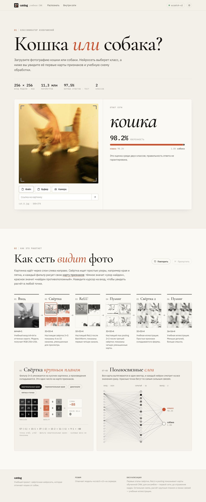
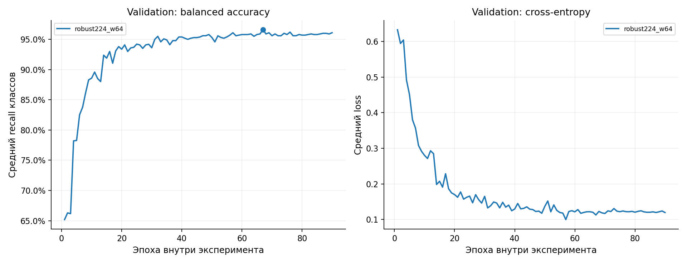
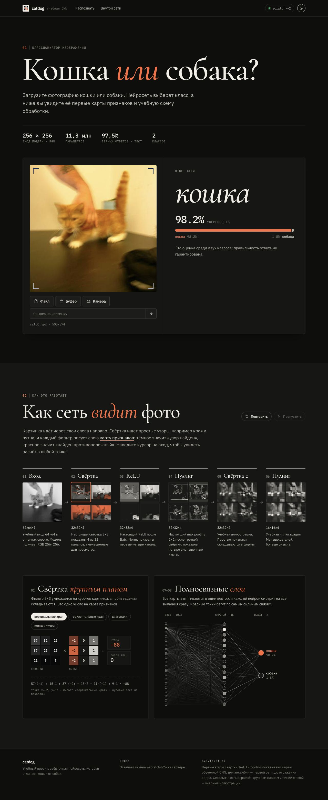

# Catdog from scratch

[Русская версия](README.ru.md) · [ML learning guide](docs/LEARNING_EN.md) · [Model card](docs/MODEL_CARD.md)

A complete educational computer vision project: train a cat/dog classifier **from random initialization**, evaluate it on a separate holdout, and serve the trained network through a FastAPI API and a TypeScript website. No external pretrained weights were used.

**Recorded holdout result: 975 / 1,000 correct predictions, 97.5% accuracy.** This is a result on the documented test split, not a guarantee for every photograph.



## What is included

- A custom residual CNN with squeeze-and-excitation blocks, a three-convolution stem and 11,286,882 trainable parameters.
- Data checks, duplicate grouping, immutable split manifests, a complete training loop, validation-based selection and probability calibration.
- The final checkpoint, included in `models/`, with a SHA-256 manifest.
- FastAPI image inference with real early feature maps, bounded uploads and controlled concurrency.
- A Vite/TypeScript interface with light/dark themes, responsive layout, photo history and an explanation of the computation pipeline.
- CLI prediction, batch ZIP prediction, tests, a local Docker demo, and learning material in Russian and English.

## Recorded experiment

| Item | Value |
|---|---:|
| Valid images in the assigned dataset | 9,972 |
| Train / validation / test | 7,975 / 997 / 1,000 |
| Trainable parameters | 11,286,882 |
| Completed training epochs | 90 |
| Selected checkpoint | EMA, epoch 67 |
| Training / final inference resolution | 224 / 256 pixels |
| Validation accuracy | 969 / 997 = 97.19% |
| Test accuracy | 975 / 1,000 = 97.50% |
| Test macro F1 | 0.9750 |
| Test ROC AUC | 0.9966 |
| Approximate 95% Wilson interval | 96.34%–98.30% |
| Portable checkpoint size | 43.14 MiB |

The labels are **`0 = cat`, `1 = dog`**. The model predicts dog when `P(dog) >= 0.5`.



The test confusion matrix uses true classes as rows and predictions as columns:

| True / predicted | Cat | Dog |
|---|---:|---:|
| Cat | 483 | 14 |
| Dog | 11 | 492 |

See [evaluation.json](reports/v2/evaluation.json), [the split audit](reports/v2/data_audit.json), [training configuration](reports/v2/training/robust224_w64/config.json) and [the methodology](docs/METHODOLOGY.md). A previous experiment used a different test split; its score is not a paired comparison with this result.

## Run the website

Prerequisites: Python 3.11+, Node.js 22.12+, or Docker with Compose. Training is optional.

```bash
git clone https://github.com/seelffff/catdog-from-scratch.git
cd catdog-from-scratch
python scripts/download_model.py
docker compose up --build
```

Open **http://localhost:8000**. The checkpoint is mounted read-only, and the application serves both the site and `/api` from one origin. The model is included in the repository and the [v1.0.0 version](https://github.com/seelffff/catdog-from-scratch/tree/v1.0.0). The download script verifies the existing file and can restore it from that version if it is missing.

For a local Python/Node setup:

```bash
python -m venv .venv
source .venv/bin/activate
python -m pip install -e '.[training,dev]'
python -m pip install -e 'backend[dev]'
python scripts/download_model.py
cd frontend
npm ci
VITE_API_MODE=live npm run build
cd ..
MODEL_PATH=models/v2_best.pt STATIC_DIR=frontend/dist \
  uvicorn app.main:create_app --factory --host 127.0.0.1 --port 8000
```

On Windows, use `.venv\Scripts\activate` and set the two environment variables in your shell. The API expects the `file` field in a multipart request:

```bash
curl http://localhost:8000/api/health
curl -F 'file=@photo.jpg' http://localhost:8000/api/predict
```

Without `MODEL_PATH`, the API deliberately reports dummy mode. The quick-start commands above load the real model.

## Predict without the website

```bash
python -m catsdogs.predict photo.jpg --checkpoint models/v2_best.pt --device cpu
python scripts/predict_zip.py photos.zip --checkpoint models/v2_best.pt \
  --device cpu --output-dir outputs/photos
```

The batch tool reads images directly from ZIP, ignores macOS metadata, checks unique numeric filename IDs, and writes `id,label` CSV sorted by ID. It never trains the network or substitutes a guess for a broken image. Apple Silicon users can select `--device mps`.

## Reproduce training

The raw dataset is not committed. Obtain the assigned dataset separately, place `cat.N.jpg` and `dog.N.jpg` files under `data/raw/train/`, and use the committed [V2 split manifest](data/splits_v2.csv). The original public download is supported by `scripts/prepare_data.py`; use `--skip-audit` when retaining the provided split.

```bash
python scripts/prepare_data.py --skip-audit
python -m catsdogs.train --manifest data/splits_v2.csv \
  --output artifacts/reproduction --device mps --epochs 90 \
  --image-size 224 --batch-size 48 --workers 2 --width 64 \
  --architecture robust_resnet18 --augmentation robust --dropout 0.15 \
  --label-smoothing 0.02 --lr 0.001 --min-lr 0.000005 \
  --weight-decay 0.0003 --warmup 4 --patience 25 --min-epochs 60 \
  --seed 9001 --mixup 0.1 --ema-decay 0.995 --max-minutes 180
```

Use `--device cpu` if MPS is unavailable; this will be slower. The final artifact was chosen after checking inference resolutions on **validation**, with 256 selected. For a new run, treat that choice as a documented starting recipe, and evaluate alternatives only on validation:

```bash
python scripts/set_inference_size.py --checkpoint artifacts/reproduction/best.pt \
  --image-size 256 --manifest data/splits_v2.csv \
  --output artifacts/reproduction/infer256.pt
python -m catsdogs.evaluate --checkpoint artifacts/reproduction/infer256.pt \
  --manifest data/splits_v2.csv --output reports/reproduction \
  --device mps --finalize --model-output models/reproduction.pt
```

`--finalize` selects calibration/TTA on validation, freezes the configuration, then evaluates test. Use a new output directory for a new experiment. Do not keep tuning against an already disclosed test result. GPU kernels and versions can prevent bitwise-identical retraining; the released checkpoint is the exact reproducible inference artifact.

## Learn the ML behind it

The [English guide](docs/LEARNING_EN.md) and [detailed Russian textbook](docs/LEARNING_RU.md) explain images as tensors, parameters, logits, cross-entropy, gradients, convolution, residual blocks, optimization, regularization, calibration and reliable evaluation. The examples start with calculations small enough to do by hand.



The first convolution/ReLU/pooling visualizations use actual model activations. Later animation stages and fixed filter examples are educational illustrations, explicitly labeled in the UI.

## Project structure

```text
backend/       FastAPI application, model adapter, API tests
frontend/      Vite + TypeScript interface and tests
src/catsdogs/  Model, preprocessing, training, evaluation and CLI
scripts/       Data preparation, model download and batch prediction
data/          Split manifests; raw images remain local
models/        Final trained checkpoint and checksum manifest
reports/v2/    Sanitized recorded experiment and training history
docs/          Learning guides, model card, figures and screenshots
tests/         ML and data pipeline tests
```

## Verify the project

```bash
python -m pytest tests -q
cd backend && python -m pytest -q && cd ..
cd frontend && npm run typecheck && npm test && npm run build
```

Tests check duplicate grouping, split boundaries, model blocks, selection rules, image preprocessing, malformed requests, upload limits, and frontend behavior. Running unit tests does not retrain the released network.

## Limits and next experiments

This is a binary classifier for a photograph containing a cat or a dog. It cannot reliably reject a car, a human, an empty frame, or a photograph containing both animals. A high softmax score is not a universal confidence guarantee. Unusual breeds, lighting and image styles can differ from the training distribution.

Useful follow-up experiments are controlled augmentation ablations, per-breed error analysis with independently collected labels, probability calibration checks and an explicit out-of-distribution evaluation. Compare candidates on validation before touching a fresh test set.
